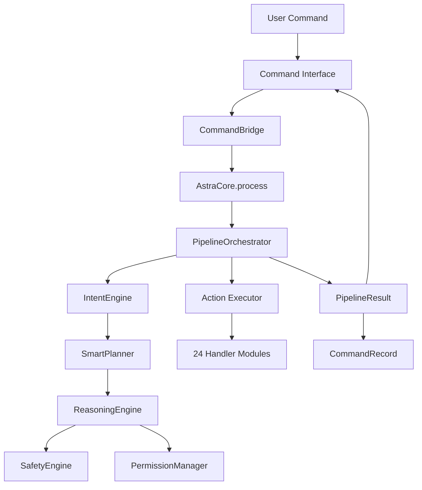

# ASTRA Architecture

## Overview

ASTRA is a **local-first Python command operating system** with a Streamlit shell and immersive HTML command center. It is not a chatbot wrapper — commands flow through a structured pipeline with intent classification, planning, permission gates, execution, and audit.

## High-level flow

## Package layout

| Path | Responsibility |
|------|----------------|
| `desktop/shell.py` | Streamlit Command OS entry |
| `ui/ultron.py` | HTML embed bridge |
| `ui/astra_interface.html` | Neural core UI, command log, inspector |
| `src/astra/core/astra_core.py` | Service container |
| `src/astra/core/pipeline/` | Orchestration |
| `src/astra/core/intent/` | 56 intents, NLU, optional LLM classifier |
| `src/astra/core/actions/handlers/` | Command implementations |
| `src/astra/core/subsystems/registry.py` | Subsystem metadata & routing |
| `src/astra/core/commands/command_record.py` | Structured command lifecycle |
| `src/astra/core/system/health.py` | Real health metrics |

## Command lifecycle

Every command conceptually follows:

1. **RECEIVED** — user input normalized
2. **UNDERSTANDING** — intent classification
3. **PLAN CREATED** — `SmartPlanner` builds `Plan`
4. **PERMISSION CHECK** — risk analysis + safety policies
5. **EXECUTION** — handler dispatch via `Executor`
6. **VERIFICATION** — action success/failure
7. **AUDIT** — `AuditLogger` for privileged actions
8. **MEMORY / LEARNING** — context, ROI, revolution metrics

## Subsystems

Agents (NOVA, PILOT, etc.) are **persona layers** routed via `ASK_AGENT`, not separate processes. FORTRESS is the security layer wrapping reasoning, safety, permissions, and audit.

See [SUBSYSTEMS.md](SUBSYSTEMS.md).

## Data persistence

Local JSON under `data/` (per-profile under `data/users/{profile}/`):

- `memory.json`, `knowledge.json`, `session.json`, `learning.json`
- `revolution.json`, `roi.json`, `usage.json`

## AI provider abstraction

`llm_client.py` supports Groq → Anthropic → OpenAI with env-based configuration. Keys never enter frontend code.

## Security model

- Risk tiers: LOW / HIGH / CRITICAL
- HIGH → confirmation required
- CRITICAL → blocked
- Policies in `data/policies.json`
- Audit log: `logs/audit.log`

## Deployment

- **Local:** `python main.py --desktop` (port 8501)
- **Streamlit Cloud:** `app.py` → `desktop/shell.py`
- **API:** `python main.py --serve` (default port **8787**)

## Observability

- Application log: `logs/astra.log`
- Metrics: in-memory counters via `MetricsCollector`
- UI health panel: uptime, optional CPU/memory (psutil), service status
